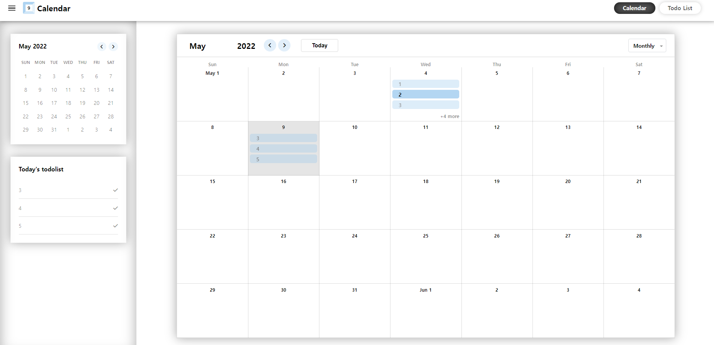

# todo-calendar

투두리스트를 관리하는 캘린더 애플리케이션 개발



## Getting Started

### Installing a development environment

```bash
# install
npm install
```

### Run the project

```bash
# Development
npm run serve

# Production
npm run build
cd dist
live-server
```

Open browser to <http://localhost:8080>

## License

MIT
